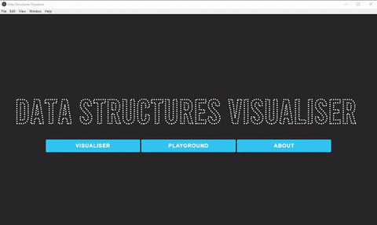
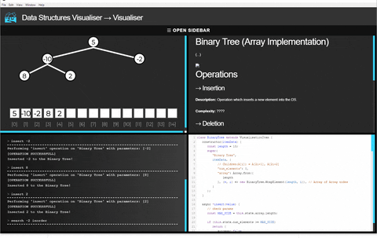

# Data Structures Visualiser
> **Notice:** Old code, not maintained.

A desktop application made with [electronJS](https://github.com/electron/electron). Its goal is to display visualisations of data structures and their algorithms involved with manipulating the data stored. The app's structure has been designed to allow the addition of visualisation items easily.

## Implemented Visualisations
**Linear**
-  Static Array
-  Queue
-  Stack

**Non-Linear**
-  Binary Tree
-  Min-Heap
-  Binary Search Tree
-  Directed Graph

## Adding New Visualisations
Visit [structures/datastructures/__example](structures/datastructures/__example)

## Media

